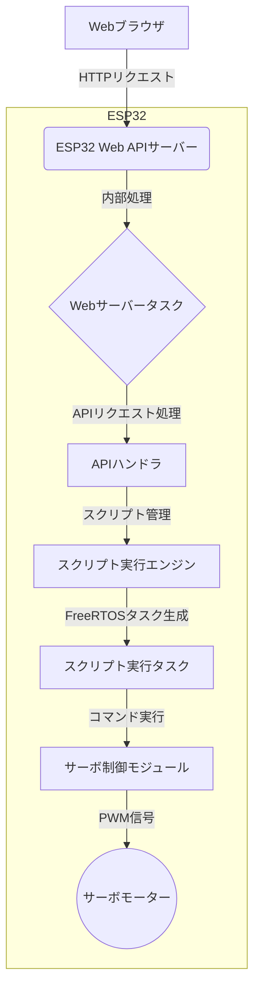

# ESP32 Web APIサーボ制御システム 完全マニュアル

**著者**: tomorrow56  
**バージョン**: 2.0  
**最終更新**: 2026年2月19日

---

## 目次

1. [概要](#概要)
2. [システムアーキテクチャ](#システムアーキテクチャ)
3. [セットアップ](#セットアップ)
4. [Webインターフェースの使い方](#webインターフェースの使い方)
5. [スクリプト言語仕様](#スクリプト言語仕様)
6. [Web APIリファレンス](#web-apiリファレンス)
7. [サンプルスクリプト](#サンプルスクリプト)
8. [トラブルシューティング](#トラブルシューティング)
9. [技術詳細](#技術詳細)

---

## 概要

本システムは、ESP32をWeb APIサーバーとして動作させ、最大10個のサーボモーターをスクリプトに基づいて自動制御するための統合ソリューションです。ユーザーはWebブラウザからスクリプトをアップロードし、ESP32上で実行を指示します。これにより、Wi-Fi経由で複雑なロボットの動作をプログラムし、制御することが可能になります。

### 主な特徴

**Web APIベースの制御**: ESP32がWi-Fi経由で提供するRESTful APIを通じて、すべての操作が行われます。これにより、Webブラウザだけでなく、PythonやNode.jsなど、さまざまなプラットフォームからシステムを制御できます。

**サーバーサイド・スクリプト実行**: アップロードされたスクリプトはESP32のメモリに保存され、ESP32のプロセッサによって直接実行されます。これにより、ブラウザを閉じてもスクリプトの実行が継続されます。

**マルチタスク対応**: ESP32のデュアルコア性能とFreeRTOSを活用し、Webサーバーの処理とスクリプトの実行を別のタスクで並行して行います。これにより、スクリプト実行中もAPIサーバーは応答性を維持します。

**高機能Webインターフェース**: スクリプトの編集、アップロード、実行、停止、およびサーボと実行状態のリアルタイム監視が可能な、モダンで直感的なWeb UIを提供します。

---

## システムアーキテクチャ

本システムは、クライアント（Webブラウザ）とサーバー（ESP32）の2つの主要部分から構成されます。



**処理フロー**:
1.  **接続**: ユーザーはWebブラウザにESP32のIPアドレスを入力し、接続を確立します。
2.  **スクリプトアップロード**: ブラウザからスクリプトがWeb API (`POST /api/script/upload`) を通じてESP32に送信され、メモリに保存されます。
3.  **実行開始**: ブラウザから実行開始API (`POST /api/script/execute`) が呼び出されると、ESP32はスクリプト実行用の新しいタスクを生成します。
4.  **スクリプト実行**: 実行タスクは、スクリプトを1行ずつ解釈し、`servo`や`wait`などのコマンドを実行します。
5.  **状態監視**: ブラウザは定期的に状態確認API (`GET /api/script/status`) をポーリングし、実行状況（現在の行番号など）をUIに表示します。
6.  **停止**: 停止API (`POST /api/script/stop`) が呼び出されると、ESP32は実行中のタスクを強制終了します。

---

## セットアップ

### 必要な環境

- **Arduino IDE** 1.8.19以降、または Arduino IDE 2.x
- **ESP32ボードサポート**: Arduino IDEのボードマネージャーからインストール
- **Wi-Fi環境**: 2.4GHz帯のWi-Fiアクセスポイント

### Arduino IDEの準備

1.  **ファイル** → **環境設定** を開き、**追加のボードマネージャのURL** に以下を追加:
    ```
    https://raw.githubusercontent.com/espressif/arduino-esp32/gh-pages/package_esp32_index.json
    ```
2.  **ツール** → **ボード** → **ボードマネージャ** で `esp32` を検索し、**esp32 by Espressif Systems** をインストールします。

### 必要なライブラリのインストール

Arduino IDEのライブラリマネージャから、以下のライブラリをインストールします。

1.  `ESP32Servo` by Kevin Harrington
2.  `ArduinoJson` by Benoit Blanchon

### ESP32への書き込み

1.  `web_api/src/esp32_servo_webapi_server/esp32_servo_webapi_server.ino` ファイルをArduino IDEで開きます。
2.  コード内の以下の部分を、ご自身のWi-Fi環境に合わせて変更します。
    ```cpp
    const char* ssid = "your_wifi_ssid";
    const char* password = "your_wifi_password";
    ```
3.  **ツール** → **ボード** から **ESP32 Dev Module** を選択します。
4.  **ツール** → **シリアルポート** から適切なCOMポートを選択します。
5.  **スケッチ** → **マイコンボードに書き込む** をクリックします。
6.  書き込み後、シリアルモニタ（ボーレート: 115200）を開き、ESP32に割り当てられたIPアドレスを確認します。

### ハードウェアの接続

サーボの信号線を指定のGPIOピンに接続します。**必ず外部電源を使用し、ESP32とGNDを共通化してください。**

| サーボチャンネル | ESP32 GPIO | ボード上の表記 |
|---|---|---|
| 0 | GPIO 23 | IO23 |
| 1 | GPIO 19 | IO19 |
| 2 | GPIO 18 | IO18 |
| 3 | GPIO 5 | IO5 |
| 4 | GPIO 17 | IO17 |
| 5 | GPIO 16 | IO16 |
| 6 | GPIO 4 | IO4 |
| 7 | GPIO 27 | IO27 |
| 8 | GPIO 14 | IO14 |
| 9 | GPIO 12 | IO12 |

---

## Webインターフェースの使い方

`web_api/web_ui/script_controller_ui.html` をブラウザで開いて使用します。

1.  **ESP32接続**: シリアルモニタで確認したIPアドレスを入力し、「接続テスト」ボタンを押します。成功するとステータスが「接続済み」になります。
2.  **スクリプト編集**: エディタに直接スクリプトを記述するか、「ファイルを開く」ボタンで既存のスクリプトファイルを読み込みます。
3.  **アップロード**: 「アップロード」ボタンを押して、現在のスクリプトをESP32に送信します。
4.  **実行**: 「実行」ボタンを押すと、アップロードされたスクリプトがESP32上で実行されます。
5.  **停止**: 「停止」ボタンで、実行中のスクリプトを強制的に中断できます。
6.  **状態確認**: 右側の「サーボ状態」パネルと、下部の「コンソール」でリアルタイムの動作状況を確認できます。

---

## スクリプト言語仕様

ESP32上で実行される、サーボ制御に特化した簡易言語です。

### 基本コマンド

#### servo - 個別サーボ制御
**構文**: `servo <channel> <angle>`
- `channel`: サーボチャンネル (0-9)
- `angle`: 角度 (0-180)

#### servos - 複数サーボ同時制御
**構文**: `servos <ch1>:<angle1> <ch2>:<angle2> ...`

#### wait - 待機
**構文**: `wait <milliseconds>`

### 制御構造

#### if / else / endif - 条件分岐

ESP32ファームウェアがネイティブに実行する条件分岐構文です。

**構文**:

```text
if <lhs> <op> <rhs>
  # 条件が真のときの処理
else
  # 条件が偽のときの処理（省略可）
endif
```

**パラメータ**:

- `lhs`: 左辺。現在は `servo<ch>`（例: `servo0`）のみ対応
- `op`: 比較演算子。`==` `!=` `>` `>=` `<` `<=` および `=`（`==`のエイリアス）
- `rhs`: 右辺の整数値（0−1800）

**例**:

```text
# サーボCH0が90度ならスイープ、それ以外はセンターに戻す
if servo0 == 90
  servo 0 0
  wait 500
  servo 0 180
  wait 500
else
  servo 0 90
endif
```

**ネスト**: `if` ブロックは最大8段までネスト可能です。

#### repeat / function / call - ブロックエディタ専用

`repeat`・`function`・`call` はブロックエディタ（`web_api/web_ui/block_editor/`）がブラウザ側でインライン展開してからアップロードします。ESP32ファームウェア側にこれらの構文は存在しません。

---

## Web APIリファレンス

### ベースURL: `http://<ESP32のIPアドレス>`

### スクリプト管理API

#### `POST /api/script/upload`
スクリプトをESP32にアップロードします。
- **リクエストボディ**: `{"script": "..."}`
- **レスポンス**: `{"status":"success", "script_id":"...", "lines":...}`

#### `POST /api/script/execute`
アップロード済みのスクリプトの実行を開始します。
- **レスポンス**: `{"status":"running", "execution_id":"..."}`

#### `POST /api/script/stop`
実行中のスクリプトを停止します。
- **レスポンス**: `{"status":"stopped"}`

#### `GET /api/script/status`
スクリプトの実行状態を取得します。
- **レスポンス**: `{"status":"...", "current_line":..., "total_lines":...}`

### サーボ制御API

#### `POST /api/servo/{channel}`
個別のサーボを制御します。
- **パスパラメータ**: `channel` (0-9)
- **リクエストボディ**: `{"angle": ...}`
- **レスポンス**: `{"channel":..., "angle":..., "status":"success"}`

#### `POST /api/servos`
複数のサーボを一度に制御します。
- **リクエストボディ**: `{"servos": [{"channel":..., "angle":...}, ...]}`
- **レスポンス**: `[{"channel":..., "angle":..., "status":"success"}, ...]`

#### `GET /api/servos`
全サーボの現在の角度を取得します。
- **レスポンス**: `{"servos": [{"channel":..., "angle":..., "pin":...}, ...]}`

---

## サンプルスクリプト

`web_api/web_ui/sample_scripts/` フォルダに、Web UIから読み込んで使用できるサンプルが含まれています。

- **wave_example.txt**: 基本的な往復動作
- **sequence_example.txt**: 順番にサーボを動かす
- **dance_example.txt**: 複数のサーボをリズミカルに動かす
- **robot_arm_example.txt**: ロボットアームの動作シーケンス
- **walking_robot_example.txt**: 歩行ロボットの動作シーケンス

**例: wave_example.txt**
```
# サーボ0を左右に振る
servo 0 0
wait 500
servo 0 180
wait 500
servo 0 90
```

---

## トラブルシューティング

### Wi-Fiに接続できない
- `web_api/src/esp32_servo_webapi_server/esp32_servo_webapi_server.ino` のSSIDとパスワードが正しいか確認してください。
- ESP32がWi-Fiの電波範囲内にあるか確認してください。

### Webページにアクセスできない
- PCとESP32が同じWi-Fiネットワークに接続されているか確認してください。
- シリアルモニタで表示されたIPアドレスが正しいか確認してください。
- ファイアウォールがHTTP通信をブロックしていないか確認してください。

### スクリプトが実行されない
- スクリプトをアップロードしましたか？ 「実行」の前に「アップロード」が必要です。
- ESP32に接続されていますか？ 接続テストで確認してください。

---

## 技術詳細

### スクリプト実行タスク

ESP32の`xTaskCreatePinnedToCore`関数を使用して、スクリプト実行専用のタスクをコア0で生成しています。これにより、Webサーバーの処理（コア1で実行）を妨げることなく、`delay()`を含むスクリプトを安全に実行できます。

### JSONパーシング

`ArduinoJson`ライブラリを使用して、HTTPリクエストのJSONボディを効率的に解析しています。メモリ使用量を抑えるため、`StaticJsonDocument`を使用しています。

### Webサーバー

ESP32の標準`WiFi.h`ライブラリに含まれる`WiFiServer`と`WiFiClient`を使用して、軽量なWebサーバーを実装しています。HTTPリクエストを手動で解析し、各APIエンドポイントへのルーティングを行っています。

---

**著者について**: このマニュアルは、tomorrow56によって作成されました。
